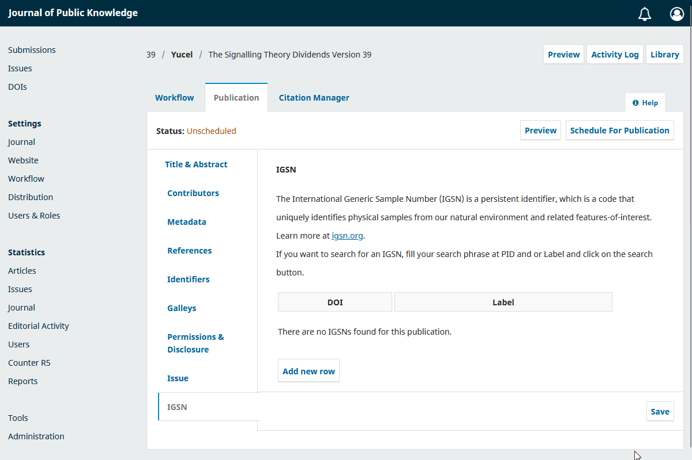

[](https://projects.tib.eu/komet/en/)

# PID Manager Plugin

PID Manager for OJS

- [PID Manager Manager Plugin](#pid-manager-plugin)
- [Features](#features)
    - [IGSN](#igsn)
- [Screenshot(s) / screen recording(s)](#screenshots--screen-recordings)
- [Install and configure the plugin](#install-and-configure-the-plugin)
    - [Requirements](#requirements)
    - [Install with Git](#install-with-git)
    - [Install via direct download](#install-via-direct-download)
    - [Configuration of the plugin](#configuration-of-the-plugin)
- [Development](#development)
    - [Structure](#structure)
    - [Notes](#notes)
    - [Debugging](#debugging)
- [Data Models](#data-models)
- [Contribute](#contribute)
    - [How to contribute](#how-to-contribute)
- [License](#license)

[](https://www.repostatus.org/#active)
[](code_of_conduct.md)

# Features

## IGSN

- Manual adding sample PIDs and labels
- Allows suggesting PIDs and Labels from DataCite
- Marks samples already added with text strike through

# Screenshot(s) / screen recording(s)



# Install and configure the plugin

## Requirements

- PHP 8.0+

## Install with Git

Get the correct version for your OJS version:

- branch main: development version, don't use for production
- branch stable-3_4_0: use this version for OJS version 3.4.0.x
- branch stable-3_5_0: use this version for OJS version 3.5.0.x

## Install via direct download

- Download release for your OJS version from [here](https://github.com/GaziYucel/pidManager/releases).
  _Note the correct version for you OJS version._
- Alternatively, download the code with the option 'Download ZIP'.
  _Note the correct branch for your OJS version._
- Extract the downloaded file to `/plugins/generic/pidManager`.

## Configuration of the plugin

- Login in your OJS instance as an Administrator or Manager
- Navigate to Website > Plugins > Installed Plugins > Generic Plugins > PID Manager Plugin
- Activate the plugin by clicking the checkbox

# Development

## Structure

    .
    ├─ .github                       # Github specific
    ├─ .project                      # Project related files
    ├─ assets                        # Styles, images, javascript files
    ├─ Classes                       # Main folder with models / logic
    │  ├─ Helpers                    # Helper classes
    │  ├─ Igsn                       # Classes for IGSN
    │  └─ Settings                   # Classes for Plugin Settings
    ├─ docs                          # Documentation, examples
    ├─ locale                        # Language files
    ├─ templates                     # Templates folder
    ├─ .gitignore                    # Git ignore file
    ├─ composer.json                 # Composer configuration file
    ├─ LICENSE                       # License file
    ├─ PidManagerPlugin.php          # Main class of plugin
    ├─ README.md                     # This file
    └─ version.xml                   # Version information of the plugin

## Notes

- Autoload of the classes in the folder `classes/` is done according to the PSR-4 specification.
- All classes have namespaces and are structured according to PSR-4 standard.

## Debugging

There is a debug mode possibility in this plugin. This constant puts the plugin in debugging mode.
Extra debug information will be written to the log file (see LogHelper class) such as API calls.
Debug information is written to the log file in the `files_dir` directory of your OJS instance.
You can find the `files_dir` constant in your config.inc.php file.

Please put the following in the file config.inc.php to enable this:

```
[PidManagerPlugin]
isDebugMode=true
```

_Careful with sensitive information, (passwords, tokens) will be written in plain text._

# Data models

## IGSN

De IGSNs are saved in the publication_settings as an array of IGSN data models.

| name  | description                         |
|-------|-------------------------------------|
| doi   | Persistent identifier of the sample |
| label | Label of the sample                 |

```
[
  { 'doi': '10.58031/kiel0188gczz101', 'label': 'Sediment core SO257_1-5' },
  { 'doi': '10.58031/kiel0188gczi201', 'label': 'Sediment core SO257_6-2' },
]
```

# Contribute

All help is welcome: asking questions, providing documentation, testing, or even development.

Please note that this project is released with a [Contributor Code of Conduct](code_of_conduct.md).
By participating in this project you agree to abide by its terms.

## How to contribute

- Fork the repository
- Create a feature branch in your fork
- Make your changes
- Open a PR with your changes

# License

This project is published under GNU General Public License, Version 3.
